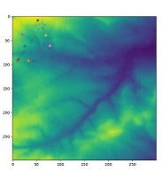

## [*Download Agent Base Model Codes*](https://github.com/haymadanny/)          

**Agent Base Model (ABM)**
 

The ABM is part of a portfolio in the Programming in Python module. This course is designed to teach the basics of computer programming, centering on the Python programming language. The example used is taken from spatial analysis and modelling, and is aimed to teach persons who are interested in scientific programming that analyses real-world systems: social scientists, ecologists, economists, etc.

 
 
The ABM is a model that:
<ol style="margin-left: 20px; margin-top: 0px">
 <li>Builds agents in a space;</li>
 <li>Gets them to interact with each other;</li>
 <li>Reads in environmental data;</li>
 <li>Gets agents to interact with the environment;</li>
 <li>Randomizes the order of agent actions;</li>
 <li>Displays the model as an animation;</li>
 <li>Is contained within a GUI;</li>
 <li>Is initialised with data from the web.</li>
</ol>
  

It is expected that this model will provide the basics in Python programming language and will be useful for the creation of many models of social, environmental or ecological systems. 

This program was designed, written and taught by [*Dr. Andrew Evans*](http://www.geog.leeds.ac.uk/people/a.evans/), University of Leeds. 

[About me](README.md)

________________________________________________________________________________________________
For further information:

<a href="http://www.geog.leeds.ac.uk/courses/computing/study/core-python/>Geograph Programming Courses</a>

